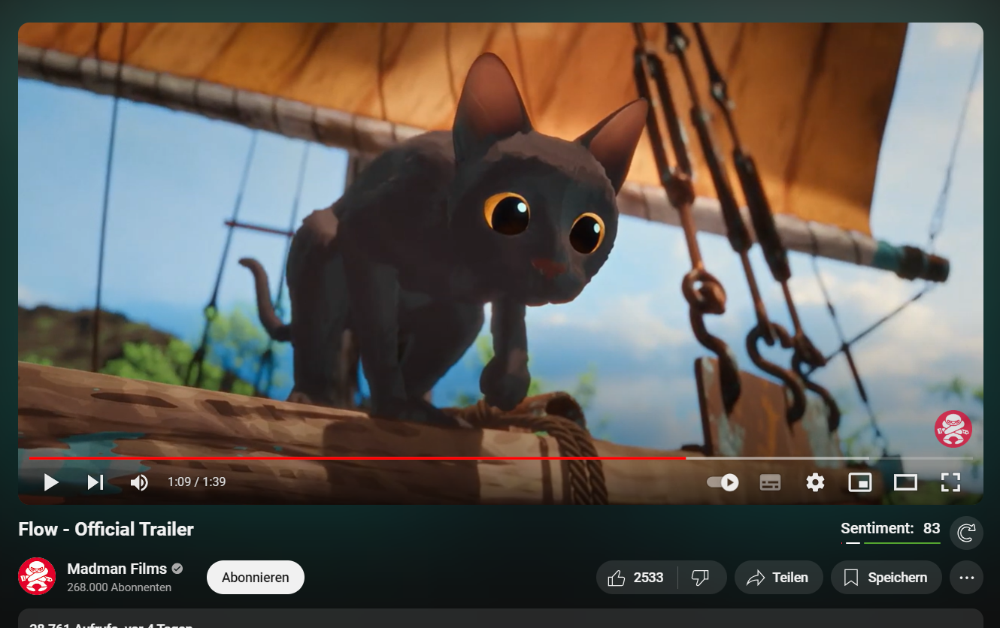

# Youtube Sentiment Analyzer

The style in which people write their comments can tell you a lot about how a video was perceived and what the general opinion of the content was.

This extension analyzes the sentiment of Youtube comments to give you a good overview of the feelings of the community.

This can serve as a good alternative to likes and dislikes, now that dislikes are no longer visible.

### Features

- **Evaluate by Scrolling**: Let the extension scroll your web page to load all comments and analyze the sentiment of each commenter without being restricted by limits.
- **Evaluate with API**: Use the official Youtube API to fetch and analyze all comments. This method is much faster.
- **Limit number of comments**: Decide for yourself if you want to include only 100 or 10000 or any other number of comments.
- **Calculate weightes sentiment**: Likes left on a comment will be taken into account when calculating the sentiment. So not only the comment authors have an influence, but also the people who just leave a like.
- **Calculate on load**: If you choose the API, you can have the sentiment calculated automatically when the video loads, without having to think about it.

**Supported comment languages**: English (More coming soon)

 
<a property="dct:title" rel="cc:attributionURL" href="https://github.com/LucaswithC/Youtube-Sentiment-Extension">Youtube Comment Analyzer Extension</a> by <a rel="cc:attributionURL dct:creator" property="cc:attributionName" href="https://addons.mozilla.org/de/firefox/user/15076637/">Lucas Kiers</a> is licensed under <a href="https://creativecommons.org/licenses/by-sa/4.0/?ref=chooser-v1" target="_blank" rel="license noopener noreferrer" style="display:inline-block;">CC BY-SA 4.0</a>

